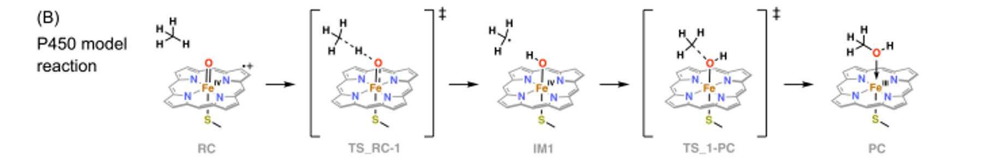
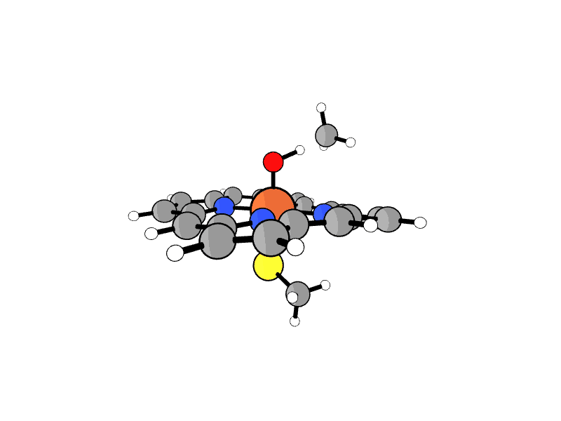
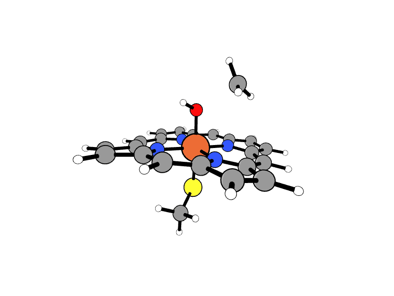

# Porphyrin Reaction Pathway

This repository contains computational data for a two-step porphyrin reaction calculated using UMA-S.  
`.traj` and  `.extxyz` files are in *ase-compatible format*.

## Target Reaction

  

## Files

### Reactant and Product Structures
- **reactant.xyz**: Initial reactant structure.
- **product.xyz**: Final product structure.

### Transition States
- **ts_1.xyz**: First transition state (TS1) with a reaction barrier
- **ts_1.extxyz**: TS1 in extxyz format
- **ts_2.xyz**: Second transition state (TS2) for the barrierless step
- **ts_2.extxyz**: TS2 in extxyz format

### IRC Trajectories
- **irc_ts1.traj**: IRC trajectory starting from TS1
- **irc_ts2.traj**: IRC trajectory starting from TS2

### Imaginary Frequency Animations
- **TS1 Imaginary Mode**  
    

- **TS2 Imaginary Mode**  
    

## Notes
- TS1 corresponds to the step with a reaction barrier; TS2 corresponds to a barrierless step.
- All calculations were performed using **UMA-S w/ fairchem@meta**.
- Initial structures(reactant & product) and `asset/porphyrin_rxn.png` from *10.26434/chemrxiv-2025-zvkqk*